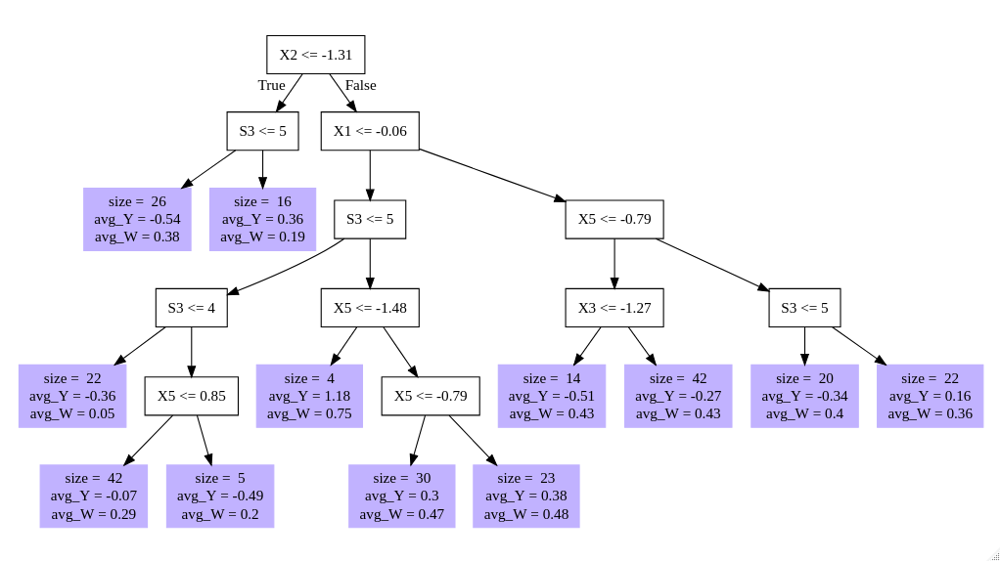
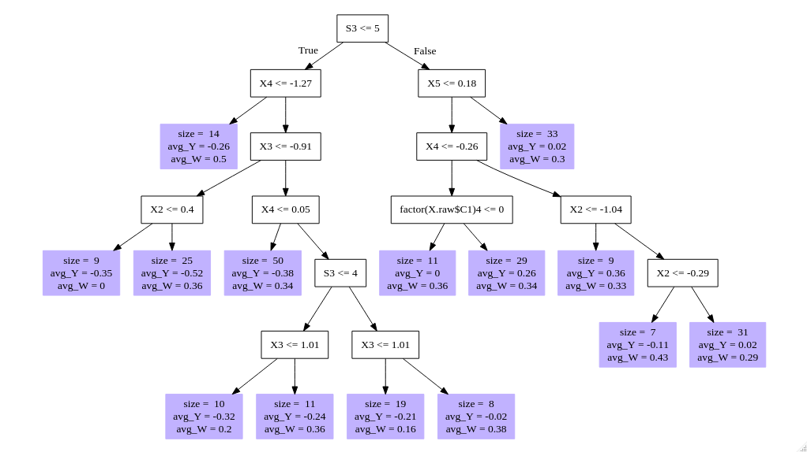
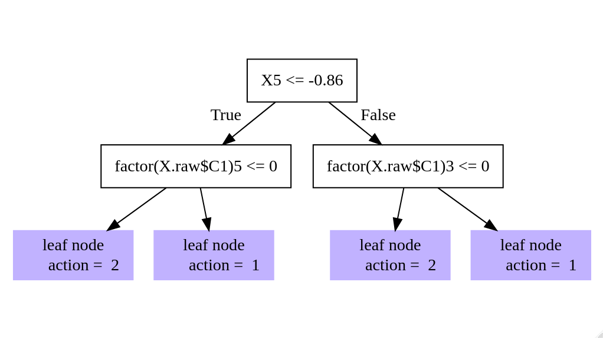

```{r setup, include=FALSE, cache=FALSE}
options(htmltools.dir.version = FALSE)
options(knitr.table.format = "html")
# Set global knitr chunk options
knitr::opts_chunk$set(
  fig.align = "center", 
  fig.retina = 3,
  fig.width = 7,
  out.width = "80%",
  fig.asp = 9/16,
  cache = FALSE,
  error = FALSE,
  message = FALSE, 
  warning = FALSE, 
  collapse = TRUE ,
  echo = FALSE
)

library(ggplot2)
library(patchwork)
library(kableExtra)
library(fontawesome)
library(RefManageR)
BibOptions(check.entries = FALSE, 
           bib.style = "authoryear", 
           cite.style = 'authoryear', 
           style = "markdown",
           hyperlink = TRUE, 
           dashed = TRUE,
           check.entries = FALSE)
bib <- ReadBib("causalforest.bib")
```

# Literature Review

Development of Causal Forest comes from a lineage of papers:

- `r Citet(bib, "athey2016recursive")`
  + Recursive partioning, honest trees

--
- .bold[`r Citet(bib, "wager2018estimation")`]
  + .bold[From trees to forests. Asymptotics]

--
- `r Citet(bib, "athey2019generalized")`
  + Trees as a kernel regression

--
- `r Citet(bib, "athey2019estimating")`
  + Application to observational data
  

Other important results and applications

- `r Citet(bib, "wager2014confidence")` - Variance estimation
- `r Citet(bib, "oprescu2019orthogonal")` - Orthogonal Forests
- `r Citet(bib, "davis2017using")` - Application to summer jobs

---
# Motivation

* ML methods perform well in practice, but many do not have well established asymptotics or confidence intervals

--
* Causal Inference is .red[NOT] the same as prediction.
  + Fundamental problem of causal inference

--
* Random Forests can potentially address several questions of interest:
  + Effect heterogeneity among subgroups
  + Robustness to model specification
  + Personalized estimates

--
* Tackle high-dimensional problems

---
# Potential outcomes framework

We observe a set of i.i.d. units $i = 1, \ldots, n$ whose tuples $(X_i, Y_i, W_i)$ are:
- Feature **vector** $X_i$,
- Outcome $Y_i \in \mathbb{R}$
- Treatment assignement $W_i \in \{0, 1\}$

--

The **conditional average treatment** effect is defined as: $$\tau(x)=\mathbb{E}[Y_i^{(1)}-Y_i^{(0)}| X_i = x]$$
where $Y_i^{(0)}$ and $Y_i^{(1)}$ are the potential outcomes when not treated and treated respectively

---
background-image: url(fig/magic.gif)
background-size: cover

# .red[Assumptions]

.font150.center.white[ML is .bold[not dark magic]! We still need to make assumptions to infer the causal effect.]

---
# .red[Assumptions]

ML is .bold[not dark magic]! We still need to make assumptions to infer the causal effect.

Unconfoundedness must hold:

$$\{Y_i^{(0)}, Y_i^{(1)}\}\perp W_i | X_i$$
--

All other usual causal inference assumptions: SUTVA, individualistic assignment, probabilistic assignment

---
# Causal Trees

Units on the same leaf $L(x)$ can be understood as _matched neighbors_

Random forests are essentially an adaptive nearest neighbors estimation

Given traditional causal .red[assumptions], we can treat nearby observations in X-space as having come from a randomized experiment

Natural to estimate the treatment effect locally as:

$$\hat\tau(x)=\frac{1}{|S_1(x)|}\sum_{i\in S_1(x)}Y_i - \frac{1}{|S_0(x)|}\sum_{i\in S_0(x)}Y_i \qquad\qquad\text{(1)}$$

+ $S_1(x)=\{i:W_i=1, X_i \in L(x)\}$ and $S_0(x)=\{i:W_i=0, X_i \in L(x)\}$

---
# From Trees to Random Forests 

We have a training set $Z_i=\{(X_i, Y_i, W_i)\}_{i=1}^n$, a set $\mathcal{B}$ of trees and each tree $b\in \mathcal{B}$ provides an estimation through a base learner $T$

$$\hat\tau_b(x)=T(x; Z_i^b)$$

--

.bold[Random forest idea]: grow and average many different trees based on the same learner

$$\hat\tau(x)=\frac{1}{|\mathcal{B}|}\sum_{b\in\mathcal{B}}T(x; Z_i^b)$$
--

- Different estimations: $T(x; Z_i^b) \neq T(x; Z_i^{b'})$
  + Subsampling (without replacement, .red[not bagging!])
  + Random-split trees: randomly select only $m<p$ features to make the split at each step  

---
# Two Procedures

.footnotesize[
.pull-left[
.blue[Double-sample trees]

1. Random subsample of size $s$ from $\{1, \ldots, n\}$
.bold[without replacement], then $|\mathcal{I}| = s/2$ and $|\mathcal{J}| = s/2$.
2. Grow a tree via recursive partitioning. The splits are chosen using any data from the $\mathcal{J}$ **and X or W observations** from the $\mathcal{I}$. Honesty. Minimum leaf size $k$.
3. Estimate leafwise responses using only the $\mathcal{I}$-sample observations.

Double-sample causal trees the prediction estimated is $\hat\tau(x)$ using (1) on the $\mathcal{I}$-sample. Following Athey and Imbens (2016), the splits of the tree are chosen by maximizing the variance of $\hat\tau(X_i)$ for $i\in \mathcal{J}$. Each leaf of the tree must contain $k$ or more $\mathcal{I}$-sample observations of **each** treatment class.
]]

--

.footnotesize[
.pull-right[
.blue[Propensity trees]

1. Random subsample $\mathcal{I} \in \{1,\ldots, n\}$ of size
$|\mathcal{I}| = s$ (no replacement).
2. Train a **classification** tree using sample $\mathcal{I}$ where the
response is the **treatment assignment**. Using only $(X_i , W_i)$ pairs with $i\in\mathcal{I}$. Each leaf of the tree must have $k$ or more observations of each treatment class.
3. Estimate $\hat\tau(x)$ using (1) on the leaf containing $x$.

Propensity trees use only the treatment assignment indicator
$W_i$ to place splits, therefore, they are honest by design and save the responses $Y_i$ for estimating $\hat\tau(x)$.
]]

---
# Asymptotic Normality

Regression .red[random forests] are asymptotically Gaussian if the following assumptions hold:
- Honest, random-split, k-regular and symmetric tree (Definitions 2 to 5 of `r Citet(bib, "wager2018estimation")`)
- Lipschitz continuous response, $\mu(x)=\mathbb{E}\left[Y|X=x\right]$
- Subsample size $s_n$: $\displaystyle\lim_{n\rightarrow\infty} s_n = \infty$ and  $\displaystyle\lim_{n\rightarrow\infty} s_n\log(n)^d / n=0$
- $\mathbb{E}\left[|Y-\mathbb{E}[Y|X=x]|^{2+\delta}|X=x\right]\leq M$, $\delta, M>0$, uniformly over all $x\in\left[0,1\right]^d$

--

.bold[Theorem 3.4] `r Citet(bib, "wager2018estimation")` If above conditions hold, then there exists a sequence $\sigma_n(x)\rightarrow 0$ such that

$$\frac{\hat\mu_n(x)-\mathbb{E}\left[\hat\mu_n(x)\right]}{\sigma_n(x)}\overset{d}{\rightarrow}\mathcal{N}(0,1)$$

---
# Asymptotic Variance Estimation

Infinitesimal jacknife for .red[random forests]<sup>1</sup>. Define:

- Response as $\hat\mu_b(x)$
- Number of times $i-th$ observation was used as $N_{bi}$
- $Cov$ as the covariance taken with respect to all trees in the forest

.footnote[<sup>1</sup> See `r Citet(bib, "wager2014confidence")` for details.]
--

Random Forest infinitesimal jacknife variance estimator
$$\widehat V_{IJ}(x)=\underbrace{\frac{n-1}{n}\left(\frac{n}{n-s}\right)^2}_{\text{finite sample adjustment}}\sum_{i=1}^n Cov\left(\hat\mu_b(x), N_{bi}\right)^2$$

---
# Asymptotic Variance

.bold[Theorem 3.5] `r Citet(bib, "wager2018estimation")` Let $\hat V_{IJ}$ be the infinitesimal jacknife for random forests. Then, under the conditons of Theorem 3.4,

$$\widehat V_{IJ}(x)/\sigma_n^2(x)\overset{p}{\rightarrow}1$$
--
Going from random forests to causal forests is trivial. Adapt definitions of honesty and regularity
+ A causal tree is honest if it does not use the responses $Y_1, \ldots, Y_s$ to place its splits

--
+ A causal tree is $\alpha$-regular at $x$ if (1) each split leaves at least a fraction $\alpha$ of the available units on each side of the split, (2) $L(x)$ has at least $k$ observations for each treatment group, and (3) $L(x)$ has either less than $2k − 1$ observations with $W_i = 0$ or $2k − 1$ observations with $W_i = 1$

--

.bold[Theorem 4.1] `r Citet(bib, "wager2018estimation")` provides consistency, Gaussian asymptotics and infinitesimal jacknife variance estimator

---
# Application

`r Citet(bib, "athey2019estimating")` apply Causal Forests to investigate heterogeneity on the National Study of Learning Mindsets

NSLM: U.S. public high schools. Evaluate the impact of a nudge-like intervention designed to instill students with a growth mindset<sup>2</sup> on student achievement

NSLM was randomized, but there seems to be some selection effects

Treat the data as coming from an observational study and .red[assume unconfoundedness]

School **clusters**

.footnote[<sup>2</sup> The belief that intelligence can be developed, aka _"there is still hope for me"_]

---
# Questions to be answered

1. Was the mindset intervention effective in improving student achievement?

2. Was the effect of the intervention moderated by school level achievement (X2) or pre-existing mindset norms (X1)? In particular there are two competing hypotheses about how X2 moderates the effect of the intervention: Either it is largest in middle-achieving schools (a “Goldilocks effect”) or is decreasing in school-level achievement.

3. Do other covariates moderate treatment effects?

---
# Was the intervention effective?

The authors use a modified version of Causal Forests. Random Forests as an adaptive kernel method with dobly-robust causal effect estimation. **Generalized random forests**, `r Citep(bib, "athey2019generalized")` 

```{r grf-setup, echo = FALSE, cache=TRUE}
library(grf)
library(policytree)
data <- read.csv("R/synthetic_data.csv")
set.seed(123987)
school_id <- data$schoolid
data$schoolid <- factor(data$schoolid)
school_mat <- model.matrix(~ schoolid + 0, data = data)
school_size <- colSums(school_mat)
W <- data$Z
Y <- data$Y
X.raw <- data[, -c(1, 2, 3)]
C1.exp <- model.matrix(~ factor(X.raw$C1) + 0)
XC.exp <- model.matrix(~ factor(X.raw$XC) + 0)

X <- cbind(X.raw[,-which(names(X.raw) %in% c("C1", "XC"))], C1.exp, XC.exp)
# Modelling propensity scores and outcome with random forests
Y_forest <- regression_forest(X, Y, 
                              clusters = school_id, 
                              equalize.cluster.weights = TRUE)
Y_hat <- predict(Y_forest)$predictions
W_forest <- regression_forest(X, W, 
                              clusters = school_id, 
                              equalize.cluster.weights = TRUE)
W_hat <- predict(W_forest)$predictions
cf_raw <- causal_forest(X, Y, W, Y.hat = Y_hat, W.hat = W_hat,
                       clusters = school_id,
                       equalize.cluster.weights = TRUE)
varimp <- variable_importance(cf_raw)
select_idx <- which(varimp > mean(varimp))

```

--
```{r ate, echo = TRUE, cache=TRUE, results='markup'}
# Causal Forests
cf <- causal_forest(X[, select_idx], Y, W, Y.hat = Y_hat, W.hat = W_hat,
                   clusters = school_id,
                   equalize.cluster.weights = TRUE,
                   tune.parameters = "all")
average_treatment_effect(cf)
```

---
# Treatment heterogeneity

```{r, cache=TRUE}
tau_hat <- predict(cf)$predictions
data_hat <- cbind(data, tau_hat)
```

```{r box-plot, fig.cap="Treatment effect heterogeneity", cache=TRUE}
box1 <- ggplot(data_hat, aes(round(X1), tau_hat)) +
  geom_boxplot(aes(group = factor(round(X1)))) +
  geom_smooth(method = "loess") +
  labs(x = "X1", y = "estimated CATE") +
  theme_classic()
  
box2 <- ggplot(data_hat, aes(round(X2), tau_hat)) +
  geom_boxplot(aes(group = factor(round(X2)))) +
  geom_smooth(method = "loess") +
  labs(x = "X2", y = "estimated CATE") +
  theme_classic()
box1 | box2
```


---
# Do other covariates moderate the effect?

Once we have a .red[Causal Forest] fit, we can visualize a specific tree

```{r viz-tree1, cache=TRUE}
tree1 <- get_tree(cf, 1)

```

---
# Do other covariates moderate the effect?

Once we have a .red[Causal Forest] fit, we can visualize a specific tree

```{r viz-tree2, cache=TRUE}
tree2 <- get_tree(cf, 2)

```

---
# Do other covariates moderate the effect?

Once we have a .red[Causal Forest] fit, we can visualize a specific tree

Or, we can derive an assignment rule as a shallow tree, `r Citep(bib, "AtheyWager2021policy")`

```{r policy, cache=TRUE}
dr.scores <- double_robust_scores(cf)
poltree <- policy_tree(X, dr.scores, 2)

```

---
# References

.footnotesize[
```{r ref, results = 'asis'}
PrintBibliography(bib)
```
]

---
class: clear, center, middle

background-image: url(fig/raising-hand.gif)
background-size: cover

<br><br><br><br><br><br><br><br><br><br><br><br><br>
.font300.white.bold[Questions?]
`r # anicon::nia("Questions?", animate = "pulse")`
---
# Appendix

```{r variables, results = 'asis'}
vars <- c("S3", "C1", "C2", "C3", "XC", "X1", "X2", "X3", "X4", "X5", "Y", "Z")
desc <- c(
  "Student’s self-reported expectations for success in the future, a proxy for prior
achievement, measured prior to random assignment", 
  "Categorical variable for student race/ethnicity", 
  "Categorical variable for student identified gender",
  "Categorical variable for student first-generation status, i.e. first in family to go to college",
  "School-level categorical variable for urbanicity of the school, i.e. rural, suburban, etc.",
  "School-level mean of students’ fixed mindsets, reported prior to random assignment",
  "School achievement level, as measured by test scores and college preparation for
the previous 4 cohorts of students",
  "School racial/ethnic minority composition, i.e., percentage of student body that
is Black, Latino, or Native American",
  "School poverty concentration, i.e., percentage of students who are from families
whose incomes fall below the federal poverty line",
  "School size, i.e., total number of students in all four grade levels in the school",
  "Post-treatment outcome, a continuous measure of achievement",
"Treatment, i.e., receipt of the intervention"
)
vars_tb <- data.frame(vars, desc, stringsAsFactors = FALSE)
kbl(vars_tb, col.names = c("Variables", "Description")) %>% 
  kable_classic(font_size = 16, full_width = FALSE) 
  
```

---
# Appendix

This presentation is publicly available at my `r fa("github", fill = "blue")` Github repo [https://github.com/rfbressan/eesp_machine_learning](https://github.com/rfbressan/eesp_machine_learning)